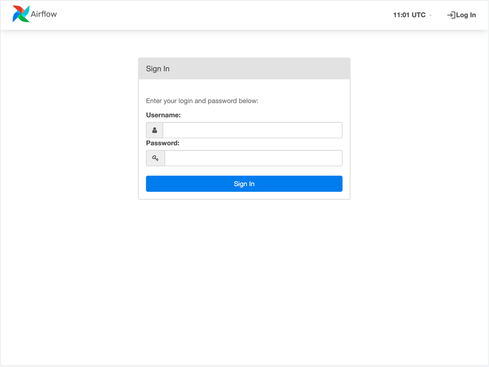
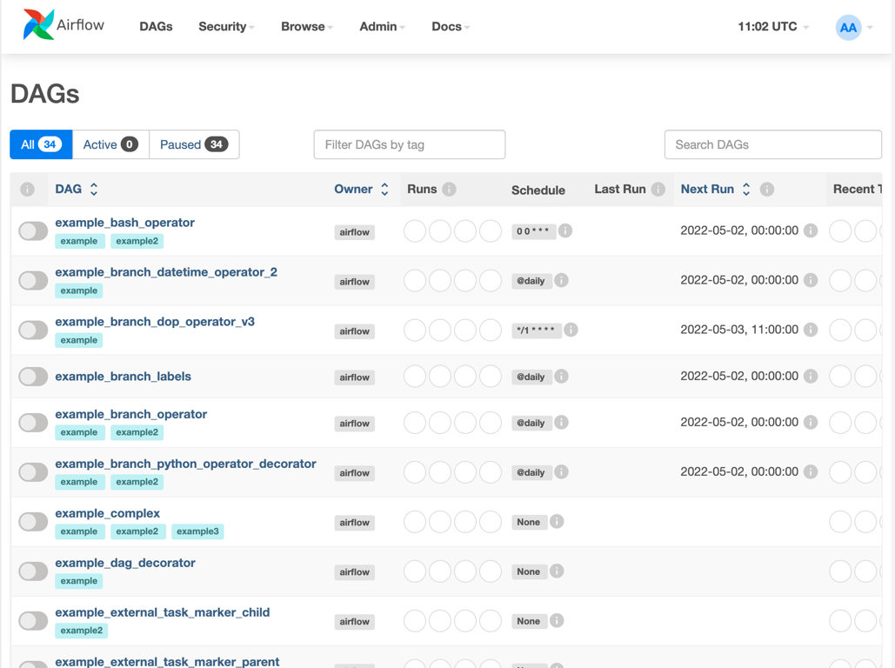

# Environment initialization

## Configure the environment
Before using Airflow, you will need to start a new environment using *docker-compose*.

Use the command below to start required components:
```sh 
make airflow-start
```

The command will take few minutes to initialize your environment and start Airflow.

## Discover the interface
Once Airflow has started up, you can log in to the web interface at: *[http://localhost:8080](http://localhost:8080)*. 

> The login account to use is *airflow* and the password is *airflow* too.


If everything went well yYou should see something like this:


TODO: Complete with useful information